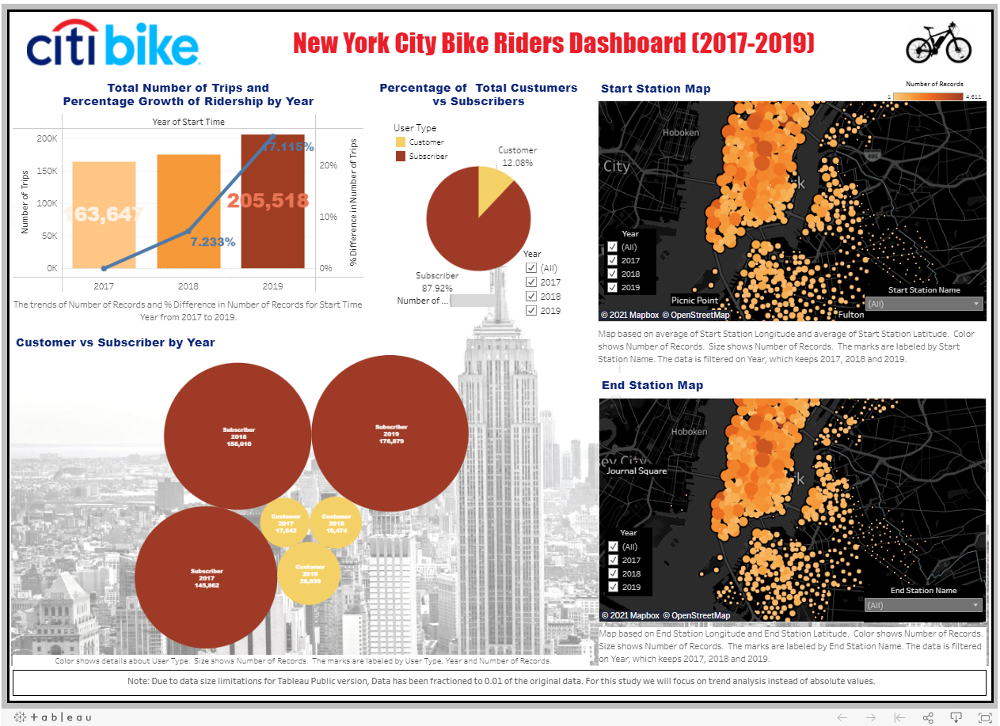

# Tableau - Citi Bike Analytics

## Background

Congratulations on your new job! As the new lead analyst for the [New York Citi Bike](https://en.wikipedia.org/wiki/Citi_Bike) Program, you are now responsible for overseeing the largest bike sharing program in the United States. In your new role, you will be expected to generate regular reports for city officials looking to publicize and improve the city program.

Since 2013, the Citi Bike Program has implemented a robust infrastructure for collecting data on the program's utilization. Through the team's efforts, each month bike data is collected, organized, and made public on the [Citi Bike Data](https://www.citibikenyc.com/system-data) webpage.

However, while the data has been regularly updated, the team has yet to implement a dashboard or sophisticated reporting process. City officials have a number of questions on the program, so your first task on the job is to build a set of data reports to provide the answers.

## Data Cleaning

After collecting the data from citi Bike Data for years 2017-2019. The data .csv file was read into a [Jupyter Notebook.](Data_cleanup.ipynb). Python code was used for data manipulation. Due to data size limitations for Tableau Public version, Data has been fractioned to 0.01 of the original data.

## Tableau Analysis

The project provides visualizations of New York City Bicycle System deployed in Tableau Public at: [New York City Bike Riders Dashboard (2017-2019)](https://public.tableau.com/profile/jessica.pardo#!/vizhome/NYCity_Bike_Analysis/NYCityBikeRidersDashboard).

### Copyright

© 2021 Trilogy Education Services, LLC, a 2U, Inc. brand. Confidential and Proprietary. All Rights Reserved.
